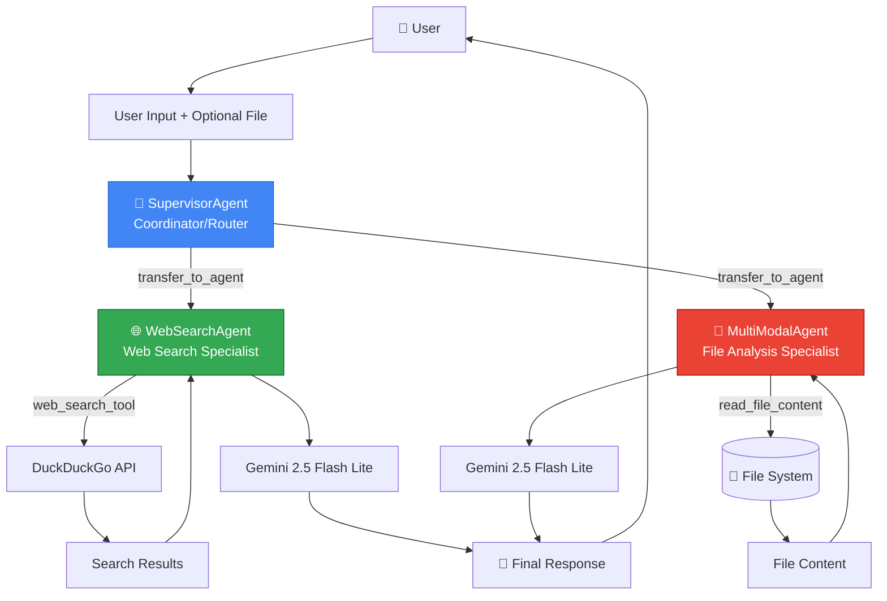
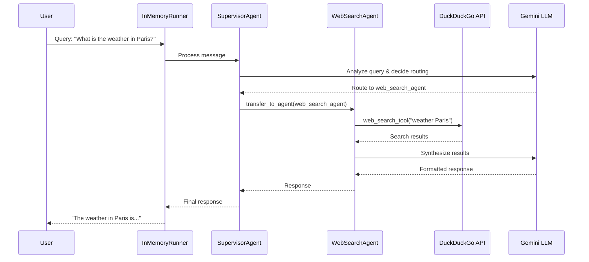
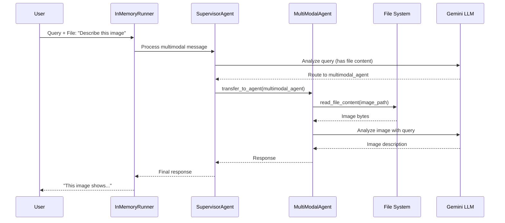

# Multi-Agent System Architecture

This document provides a comprehensive overview of the multi-agent intelligent assistant system built using Google's Agent Development Kit (ADK).

## System Overview

The system implements a **Coordinator/Dispatcher** pattern with three specialized agents working together to handle diverse user queries:

1. **SupervisorAgent** (Coordinator) - Routes queries to appropriate specialists
2. **WebSearchAgent** (Specialist) - Retrieves information from the internet
3. **MultiModalAgent** (Specialist) - Analyzes files and documents

## Architecture Diagram



## Data Flow

### Web Search Query Flow



### File Analysis Query Flow



## Component Responsibilities

### 1. SupervisorAgent (Coordinator)

**Role**: Central coordinator that intelligently routes user requests to specialist agents

**Responsibilities**:
- Analyze incoming user queries and context
- Determine the most appropriate specialist agent
- Delegate using ADK's `transfer_to_agent()` mechanism
- Never directly answer queries (always delegates)

**ADK Pattern**: Coordinator/Dispatcher with LLM-driven delegation

**Key Configuration**:
- `sub_agents`: [WebSearchAgent, MultiModalAgent]
- `description`: Clear coordinator role definition
- `instruction`: Routing logic and delegation strategy

### 2. WebSearchAgent (Specialist)

**Role**: Specialist for retrieving and synthesizing information from the internet

**Responsib ilities**:
- Perform web searches using DuckDuckGo
- Synthesize search results into coherent answers
- Handle queries about current events, facts, news, weather

**Tools**:
- `web_search_tool`: DuckDuckGo text search (max 5 results)

**ADK Pattern**: LLM Agent with tool integration

**Key Configuration**:
- `description`: "Specialized in retrieving information from the internet..."
- `tools`: [web_search_tool]
- `instruction`: How to use search and synthesize results

### 3. MultiModalAgent (Specialist)

**Role**: Specialist for analyzing and extracting information from files

**Responsibilities**:
- Read and process various file formats
- Analyze images, PDFs, spreadsheets, text documents
- Extract relevant information based on user queries

**Supported File Formats**:
- **Images**: JPG, JPEG, PNG, WebP
- **Documents**: PDF
- **Spreadsheets**: CSV, Excel (XLSX, XLS)
- **Text**: TXT, MD, PY, JSON

**Tools**:
- `read_file_content`: File reading and conversion to ADK Parts

**ADK Pattern**: LLM Agent with multimodal content processing

**Key Configuration**:
- `description`: "Specialized in analyzing files..."
- `tools`: [read_file_content]
- `instruction`: How to process files and extract information

## ADK Primitives Used

### 1. Agent Hierarchy (sub_agents)

The system uses ADK's parent-child relationship pattern:

```python
supervisor = LlmAgent(
    name="supervisor_agent",
    sub_agents=[web_search_agent, multimodal_agent]
)
```

This establishes:
- SupervisorAgent as the parent/coordinator
- WebSearchAgent and MultiModalAgent as children/specialists
- Automatic agent discoverability for delegation

### 2. LLM-Driven Delegation (transfer_to_agent)

The coordinator uses ADK's built-in `transfer_to_agent()` function:
- The LLM automatically calls this function to delegate
- Agent selection based on `description` fields
- Context and session state preserved across transfers

### 3. Shared Session State

All agents within the same invocation share `InvocationContext`:
- Same session for conversation continuity
- Shared temporary state (temp:) for data passing
- Context flows from coordinator to specialists

### 4. Tool Integration

Specialized functions exposed as LLM tools:
- `web_search_tool`: Web search capability
- `read_file_content`: File processing capability
- Tools are agent-specific and scoped accordingly

### 5. InMemoryRunner

Single runner instance manages the entire agent hierarchy:
- Root agent: SupervisorAgent
- Session management for conversation history
- Event streaming for responses

## Framework Justification

### Google ADK (Agent Development Kit)

**Why ADK?**
- **Native Multi-Agent Support**: Built-in patterns for agent composition and delegation
- **LLM-Driven Routing**: Intelligent delegation without manual if-else logic
- **Session Management**: Automatic conversation history and state handling
- **Gemini Integration**: First-class support for Google's Gemini models
- **Production Ready**: Enterprise-grade framework with proper abstractions

**Alternatives Considered**:
- LangChain: More generic, requires more manual orchestration
- Custom implementation: Reinventing patterns that ADK provides out-of-the-box

### Gemini 2.5 Flash Lite

**Why Gemini 2.5 Flash Lite?**
- **Speed**: Fast response times for interactive chat
- **Cost**: Efficient cost per token
- **Multimodal**: Native support for images and PDFs
- **Function Calling**: Reliable tool/function calling for agent delegation

### DuckDuckGo Search

**Why DuckDuckGo?**
- **Privacy**: No user tracking
- **Free**: No API key required
- **Reliable**: Consistent search results
- **Python Library**: Easy integration with `duckduckgo-search`

**Alternatives Considered**:
- Google Search API: Requires API key, complex setup
- Bing Search: Paid service
- SerpAPI: Additional dependency and cost

### File Processing Libraries

**pandas**: Excel/CSV processing with markdown conversion
**pypdf**: PDF content extraction
**Pillow (PIL)**: Image handling and validation
**Google GenAI Types**: Native multimodal content support

## Communication Mechanisms

### Request Flow

1. **User Input** → InMemoryRunner
2. **Runner** → SupervisorAgent (root agent)
3. **SupervisorAgent** → Analyzes query with Gemini
4. **Gemini** → Returns `transfer_to_agent(agent_name="...")`
5. **ADK** → Invokes specialist agent within same context
6. **Specialist** → Uses tools and LLM to generate response
7. **Response** → Flows back through coordinator to user

### Context Sharing

- All agents share the same `InvocationContext`
- Session state provides conversation history
- Temporary state (temp:) for turn-specific data
- File content passed as message parts

## Edge Cases Handled

1. **File Not Found**: Clear error message returned
2. **Unsupported File Format**: Lists supported formats
3. **Search Failures**: Graceful error handling with retry logic
4. **Empty Queries**: Validation before processing
5. **No Search Results**: Informative message to user
6. **Corrupted Files**: Exception handling with user feedback
7. **Ambiguous Routing**: Default strategies defined in coordinator

## Future Enhancements

1. **Parallel Execution**: Fan-out pattern for multiple simultaneous searches
2. **Caching**: Store search results to reduce API calls
3. **Human-in-the-Loop**: Approval workflow for sensitive operations
4. **More Specialists**: Code analysis, database query agents
5. **Memory**: Long-term memory beyond session state
6. **Streaming Responses**: Real-time response delivery

---

**Document Version**: 1.0  
**Last Updated**: 2025-11-23  
**ADK Version**: Latest (google-genai 1.52.0+)
